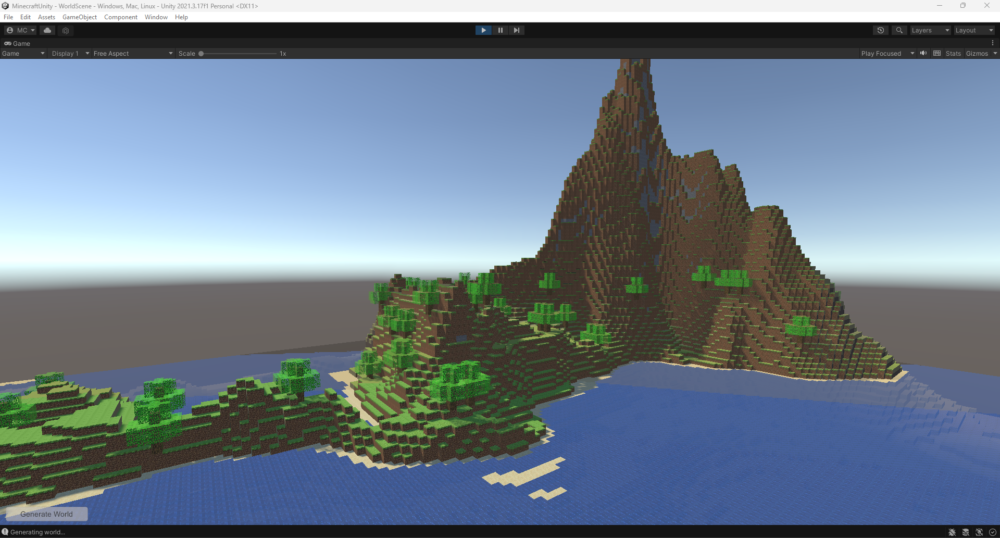

# Minecraft Unity

*It's for educational purposes only.*

This is a Minecraft clone made in Unity. It is a work in progress.

## Features

- [x] Procedural terrain generation (Perlin noise)
- [x] Chunk system
- [x] Block types
- [x] Transparent blocks
- [x] Block collision
- [ ] Block lighting
- [ ] Player implementation
- [ ] Player movement
- [ ] Player interaction (placing/removing blocks)
- [ ] Player inventory
- And more...
